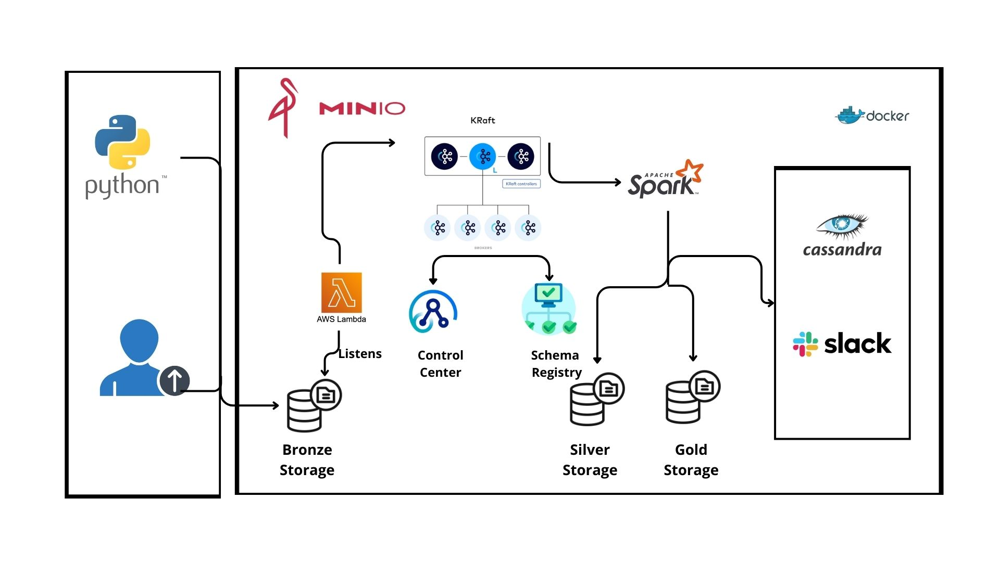

# Scalable Data Engineering Pipeline with Kafka, Kraft, and Spark

## Overview
This project implements a comprehensive data engineering pipeline for ingesting, processing, and storing data. Using AWS Lambda, Craft (for Kafka management), and Apache Spark, the pipeline efficiently handles data flow from ingestion to storage, supporting both real-time and batch data needs.

## Architecture


## Key Components

1. **Data Ingestion**:
   - **Python Scripts / API / File Loader**: Supports ingestion from various sources.
   - **AWS Lambda**: Event-driven functions listen for new data and trigger ingestion in real-time.

2. **Data Stream Management**:
   - **Kafka**: Manages data streaming to ensure consistent data flow.
   - **Kraft (Kafka Metadata Manager)**: Acts as a zookeeper-like manager, handling metadata, data cataloging, and stream coordination.
   - **Schema Registry**: Maintains schema consistency across data consumers.
   - **Control Center**: Provides a dashboard for managing Kafka and Craft streams.

3. **Data Processing**:
   - **Apache Spark**: Processes data through stages:
     - **Bronze Layer**: Raw data.
     - **Silver Layer**: Structured, cleaned data.
     - **Gold Layer**: Aggregated data for analytics and reporting.

4. **Data Serving**:
   - **Cassandra**: Stores processed data, optimizing it for fast querying and analysis.
   - **Slack**: Sends real-time updates and alerts to team members.

## Data Flow Architecture

1. **Data Ingestion**:
   - Data is ingested using **Python scripts**, API calls, or file loaders.
   - **AWS Lambda** listens for events, triggering ingestion for real-time data capture.

2. **Data Stream Management with Kafka and Craft**:
   - **Kafka** manages data streaming, ensuring seamless data flow.
   - **Craft** (a zookeeper-like metadata manager) coordinates data streams and handles data cataloging.
   - **Schema Registry** enforces schema consistency across consumers.
   - **Control Center** enables visibility into the data streams.

3. **Data Processing with Spark**:
   - **Bronze Layer**: Raw data.
   - **Silver Layer**: Cleaned and enriched data.
   - **Gold Layer**: Aggregated, analytics-ready data.

4. **Data Serving**:
   - **Cassandra** is used for fast querying of structured data.
   - **Slack** notifies the team with real-time insights.

## Benefits
- **Scalability**: Kafka and Craft manage data streams for efficient scaling.
- **Reliability**: AWS Lambda and Kafka ensure reliable data streaming.
- **Flexibility**: Modular design allows for integration of additional data sources.
- **Performance**: Layered processing enhances both data quality and query performance.

## Future Enhancements
- **Machine Learning**: Integrate models for advanced predictive analytics.
- **Real-Time Expansion**: Further enhance real-time capabilities with additional tools.
- **Data Governance**: Implement policies for data quality and security.
- **Advanced Analytics**: Apply data mining and machine learning for deeper insights.

## Repository Structure

```plaintext
data-engineering-pipeline/
├── README.md                 # Project overview
├── src/                      # Source code
│   ├── ingestion/            # Python scripts, API calls, file loaders
│   ├── streaming/            # Kafka and Craft configuration
│   ├── processing/           # Spark scripts (bronze, silver, gold layers)
│   ├── serving/              # Cassandra and Slack integration
│   └── utils/                # Helper functions
├── dags/                     # Airflow DAGs
├── config/                   # Kafka, Craft, schema registry settings
├── images/                   # Project images (e.g., architecture.png)
└── docs/                     # Additional documentation
